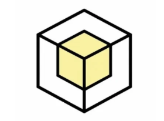

## Overview

Inspired by the idea of preserving real-world spaces as digital memories, this project explores how LiDAR-enabled iOS devices can capture, store, and revisit environments in 3D. The app allows users to scan physical spaces as colored point clouds, browse them as “memories,” and attach spatial notes directly inside the captured environment.

By combining AR, depth sensing, and intuitive UI design, the project demonstrates a lightweight alternative to full 3D reconstruction, focused on accessibility, exploration, and annotation.

Video Demo: [Click Here!](https://youtu.be/C2PgGgBGOvc)

---

## How It Works

Users interact with the app entirely on-device using a LiDAR-enabled iPhone or iPad. The workflow is as follows:

- Start a new scan using the device’s LiDAR sensor
- Walk through the environment while depth and color data are captured
- Filter points in real time by distance and confidence
- Save the scan as a navigable “memory”
- Reopen memories to explore the point cloud in 3D
- Add notes anchored to specific positions in the scanned space

All processing and storage happen locally on the device.

---

## Tech Stack

- Swift
- SwiftUI
- ARKit (LiDAR scene depth)
- RealityKit
- SceneKit
- CoreMotion

---

## Mobile Application

Our iOS interface focuses on clarity and exploration, featuring:

- A streamlined LiDAR scanning experience
- Adjustable scan filters for depth confidence and distance
- A directory of saved memories with previews and favorites
- Multiple viewing modes (overview, bird’s-eye, immersive AR)
- Spatial notes pinned directly inside the 3D scan

---

## Technical Implementation

The app runs an ARKit session with scene depth enabled to access LiDAR data.  
Each frame provides a depth map, confidence map, and RGB image, which are combined to reconstruct world-space points.

Key implementation details include:

- Depth-to-world coordinate reconstruction using camera intrinsics
- Confidence-based filtering to remove unreliable points
- Grid-based deduplication to reduce noise
- Color sampling from the camera image
- Export of scans as ASCII PLY point clouds
- SceneKit-based rendering for efficient point cloud visualization

---

## Data & Storage

Each scan is stored locally as a self-contained “memory”:

- A colored PLY file for the point cloud
- Metadata describing the scan
- Optional photos with camera pose information
- Spatial notes saved with 3D coordinates

Scans can also be accessed via the Files app for easy export.

---

## Use Cases

- Capturing and revisiting meaningful spaces
- Annotating environments for reminders or planning
- Experimenting with LiDAR point cloud visualization
- Prototyping spatial memory and AR note-taking concepts

---

## Limitations & Future Work

Current limitations include large file sizes for dense scans and depth-based point clouds rather than full mesh reconstructions.

Potential future improvements:

- Mesh or surfel-based reconstruction
- Improved live scan visualization
- Cloud sync and sharing
- More precise spatial note placement
- Performance optimizations for large environments

---

## Requirements

- iPhone or iPad with LiDAR sensor
- iOS 16+
- Xcode 15+
- Camera and motion permissions enabled
